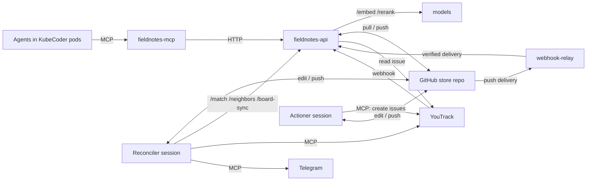
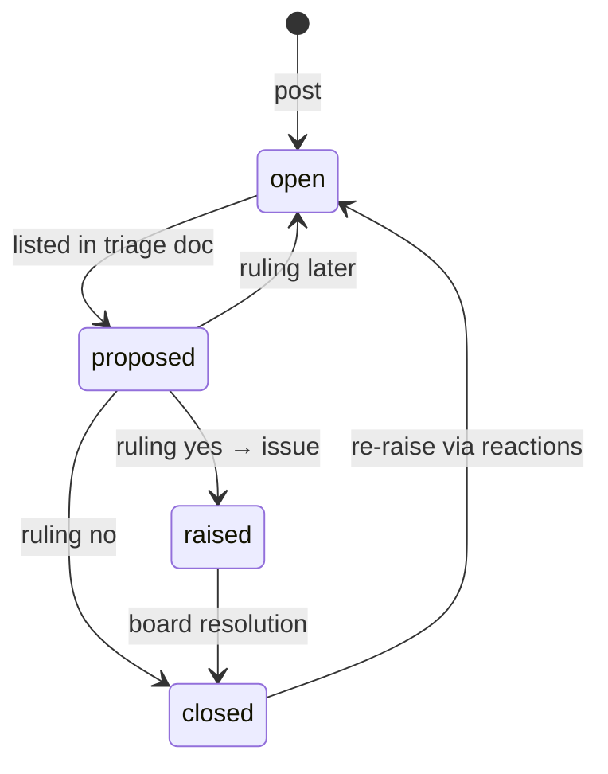

# Fieldnotes: design

What Fieldnotes is, the decisions it is built on, its numbered requirements and its technical design.
This is the design the first version is built from, scoped as a proof of concept: enough to find out
whether the idea proves its value. The requirement numbers (`FR-n`, `NFR-n`) are what tests and
commits cite. A decision this doc leaves open is the operator's to rule, not something to settle in
code.

## Purpose

Fieldnotes replaces agent memory with a curated, cross-project store. The observations agents now
leave in close-out reports and in their own memory files, where nobody reads them, go here instead.
An agent posts an observation; the server answers with likely duplicates and their reaction counts,
and the agent reacts to one instead of re-posting. That post-time answer makes Fieldnotes a
just-in-time knowledge base without any search tool.

A scheduled reconciler session curates the store, researches selected observations, checks the board
and writes a triage document. The operator rules; an actioner session turns rulings into YouTrack
issues and recorded decisions. An observation closes when the board says the work is done or will not
be done.

The tool exists to take work off the operator that the operator does not want to do, so that
observations with potential value are not lost when a project's close-out pile is cleared in one
sweep.

Working names: the store is Fieldnotes, an item is an observation.

## Decisions

The value sits in the reconciler and in the post-time duplicate response; capture is plumbing.
Everything below follows from that.

| Topic | Decision | Rationale |
| --- | --- | --- |
| Scope | Three bins for the reporting agent: in scope → do it; out of scope and urgent → close-out report, flagged; out of scope and not urgent → Fieldnotes. Refactoring opportunities stay in close-out reports. | Ownership is something the reporter can judge; severity is not. Fieldnotes is cross-project memory with an editor, not a tech-debt register. |
| Category | Enum `hint` / `idea` / `friction`, no `bug`; non-normative, the reconciler may recategorize. | A forcing function: the reporter must articulate the observation as one thing. Product bugs go to the operator through the close-out report; friction covers environment and harness cost. |
| Duplicates | `post` returns the candidates that clear the *related* threshold, at most 3, open and closed, with their reaction counts, and creates nothing; the reporter reacts, or creates with `force`. When nothing clears the threshold it creates and returns no candidates. | This response is the knowledge-delivery moment, so it must not cry wolf: a list that is always three long teaches the reporter to ignore it. Closed items stay matchable so recurrence becomes a re-raise signal. |
| Reactions | One tool `react(id, emoji, text?, repo, session?)`; emoji uncurated, allows 👎. | Vote and comment merge cleanly; the emoji carries the claim type, text only when there is new information. |
| Agent search | None. Only `post`, `react`, `get`. | Observations are unverified; agents reading them as facts would propagate errors. |
| Reconciler | A session scheduled by a KubeCoder timer on a skill in the store repo, not a server feature. It owns the observation files and has free rein over them; everything outside the store is a proposal. | Keeps the server dumb; all judgment lives in versioned skills. |
| Vetting | The reconciler writes only the triage document. Documentation changes are recommended in text and become issues after a `yes` ruling, like everything else. | Docs are what every later agent reads; a wrong edit propagates. Ruling history will show what can be delegated later. |
| Output | Triage doc in the store (ask, evidence, recommendation, impact → ruling) plus a Telegram message. No cap, no threshold. | A cap drops important items when volume is high and pads when it is low. Rulings are also calibration data for the next pass. |
| Rulings | `yes`, `no` + reason, `later` + revisit trigger, `merge into <id>`. | "no with reason" is the decision record; "later" is where evidence-gathering time lives. |
| Closure | Closed when the board says so: a YouTrack webhook into the API, and a board scan at the start of each reconciler run. The link is one-way: the observation records its issue id in `card`, and the board carries nothing of ours. Outcome from a configured resolution field (Resolved, Absorbed → done; Won't Do → wont-do), pointer in a comment. No resolution MCP tool. | The board is trusted; the tool would duplicate it. The operator sets the resolution field after the issue reaches Done, so a later change must still be applied. |
| Card feedback | Any change to an observation's card, a comment included, puts the observation back in the reconciler's queue: board sync records the card's latest change on the file. The reconciler reads what changed and does with the observation what it judges right. | What the board learns about an observation, such as a solution or a proposed one, flows back into it, and so to the next agent whose post matches it. |
| Expiry | No TTL. Validity comes from 👎 reactions and the reconciler checking the project. | The TTL was a proxy for validity; project access replaces the proxy. |
| Storage | Git on GitHub, one file per observation; `last_updated` covers the whole file and drives the reconciler queue. Four statuses; condensing, merging and splitting are maintenance, not states. Embeddings are cached on the API's volume, content-addressed by model and hash of the embedded text. | Reversible edits and per-item history. The cache is disposable: deleting it costs a reindex and nothing else. |
| Matching | Brute-force cosine + BM25 for candidates, cross-encoder reranker from day one, reporter LLM decides. | Embeddings measure aboutness; the reranker measures sameness, which is the actual problem, and its score is an absolute estimate that a threshold can be set on. |
| Models | Self-hosted Text Embeddings Inference: `BAAI/bge-base-en-v1.5` and `BAAI/bge-reranker-base`. English only. | Small CPU models match API quality for paraphrase detection; no egress dependency. |
| Topology | One model pod (two TEI containers behind NGINX) on a pinned high-performance node, deployed from the homelab's chart repo and owned by no application. One Fieldnotes pod: the API, the MCP server and a webhook relay as three containers. No scheduler in the API. | The models are shared infrastructure. The API and the MCP server stay separate processes with an authenticated HTTP boundary between them, so the MCP server stays thin; one pod is all a proof of concept needs. |
| GitHub webhook | Deliveries reach the API through the homelab's `webhook-relay`, the only internet-facing container; the API itself is never public. | What an unauthenticated caller reaches is an HMAC check in a binary that holds no credential, not the service that holds the store's git credential. |
| Agent steering | The user-level `~/.claude/CLAUDE.md`, shared by every environment, tells agents when to post; the `dev` plugin's close-out template carries the three-bin rule. | One place reaches every project's sessions, including those that run no slice. |
| Not doing | Agent-facing search, transcript mining (dreaming), triage UI, a vector database, TTL, fine-tuned reranker, reconciler-authored doc changes, a bug category. | Volume is already sufficient; a curated document works; scale does not justify the rest. |
| Source | The field is named `repo`. A path is acceptable where no repository applies. | Repositories are the source nearly always; naming the field after the common case keeps reporters precise. |

## Functional requirements

"Must" is binding. Scheduling of sessions and the secrets a session holds are KubeCoder's and out of
scope here.

**Capture (MCP surface)**

1. FR-1 `post(area, category, text, repo, session?, force?)` must run the match pipeline unless
   `force` is set. With candidates at or above the *related* threshold it must return them, at most
   3, and create nothing. Otherwise it must create the observation and return its id.
2. FR-2 A candidate must carry: id, canonical statement, status, outcome and pointer if closed,
   reaction counts as an `emoji (n)` list, match score and class (`likely` or `related`), and the
   literal next step (`react` with the id, or `post` with `force`).
3. FR-3 Matching must include closed observations.
4. FR-4 `react(id, emoji, text?, repo, session?)` must append a reaction with provenance and update
   `last_seen`. Reactions on closed observations are allowed; the reconciler treats them as a
   re-raise.
5. FR-5 `get(id)` must return the full observation including reactions and comments.
6. FR-6 The MCP server exposes exactly `post`, `react`, `get`. No search tool.
7. FR-7 `area` is free text; `category` is one of `hint`, `idea`, `friction`; `repo` names the
   repository, a path only where no repository applies; `session` is optional provenance. Product
   bugs are not observations: they go to the operator through the close-out report.

**Store and lifecycle**

8. FR-8 One markdown file per observation, `observations/<ulid>.md`, with frontmatter: `id`,
   `status`, `area`, `category`, `repos`, `created`, `last_updated`, `last_reviewed`, `last_seen`,
   `canonical`, `outcome`, `reason`, `card`, `card_updated`, `pointer`. The body holds reactions and
   comments in order; the creating post is the first reaction entry, so every report has the same
   provenance shape.
9. FR-9 Every server write is a commit on `main`, pushed. Skills edit files directly and push. A
   GitHub push delivery makes the server pull and reindex.
10. FR-10 Statuses: `open`, `proposed`, `raised`, `closed`. `outcome` is `done` or `wont-do`.
    `last_updated` changes on any write to the file, by anyone.
11. FR-11 Condensing, merging and splitting are reconciler maintenance, not states. A closed
    observation may be rewritten into a compact record and stays matchable; new information may
    still be merged into it. A merged-away observation's file is removed and its content folded into
    the survivor; git history is the record.

**Reconciler**

12. FR-12 Runs as a session started by a KubeCoder timer in an environment of the store's project,
    with the store checkout, the REST API, and the YouTrack, Telegram and KubeCoder fleet MCP tools
    available. The session first runs the `install` skill, which pulls `main` and then loads the
    requested skill.
13. FR-13 Work queue: observations with `last_updated > last_reviewed`. The run starts with a board
    scan: for every observation with a `card` it asks the API to sync that observation against the
    board, covering missed webhooks.
14. FR-14 Owns the observation files and may do with them whatever it judges right: merge, split,
    condense, recategorize, rewrite canonical statements, edit, merge or delete reactions and
    comments, add its own, close as duplicate. Must not change project repositories, documentation
    or the board; its only outputs are the store and the triage document.
15. FR-15 Must write `triage/YYYY-MM-DD.md`. Which observations it lists is at its discretion: only
    what it judges of interest, never everything. Per item: id, ask, evidence (count, distinct repos,
    first and last seen), recommendation, impact, empty `ruling` field. Recommended documentation
    changes are described in text, not drafted.
16. FR-16 Must read prior triage docs and rulings before composing, and must send a Telegram message
    with the triage doc path.
17. FR-17 To understand an item it may clone the relevant repository or start a KubeCoder
    environment. Research only; no changes there.

**Ruling and actioner**

18. FR-18 Rulings are `yes`, `no: <reason>`, `later: <trigger>`, `merge: <id>`, written in the triage
    doc in a machine-readable block.
19. FR-19 The `actioner` skill, run manually in a store checkout, executes each unactioned ruling
    through the YouTrack MCP tools: `yes` → issue whose description names the observation id for the
    reader, the issue id written to the observation's `card`, status `raised`; `no` → `closed`, outcome
    `wont-do`, reason recorded; `later` → trigger noted, stays `open`; `merge` → merged. Each ruling
    is marked actioned with a reference; reruns are no-ops.

**Board sync**

20. FR-20 The REST API verifies and handles two webhooks: GitHub push (HMAC-SHA256 signature against
    a configured secret, re-verified by the API although the relay verified it first) and YouTrack
    issue and comment events (shared token).
21. FR-21 A YouTrack event names an issue. The observation it concerns is the one whose `card` is
    that issue; an event for any other issue is ignored. The API reads the issue's current state
    from YouTrack and applies it, so the result never depends on which event arrived or in what
    order, and the board needs no field of ours. The outcome
    follows a configured resolution field and value map: `Resolved`, `Absorbed` → `done`;
    `Won't Do` → `wont-do`. A later change to the field updates the outcome. A comment
    `Resolved: <pointer>` supplies the pointer. The sync also records the time of the card's latest
    change, comments included, in `card_updated`, and writes nothing when nothing changed. The
    reconciler's board scan runs the same routine.
22. FR-22 Any change to the card, a comment included, must put its observation in the reconciler's
    queue: a new `card_updated` changes `last_updated` (FR-10, FR-13). For a queued observation with
    a card, the reconciler must read what changed on the card since `last_reviewed`, and folds into
    the observation what bears on it, such as a solution, a proposed one or a workaround, in
    whatever form it judges right (FR-14).

**Non-functional**

23. NFR-1 `post` p95 under 2 s including reranking up to 12 candidates.
24. NFR-2 200 actions per week; 10,000 observations without redesign.
25. NFR-3 English only. No runtime dependency outside the cluster, GitHub and YouTrack excepted.
26. NFR-4 REST and MCP authenticated the way the KubeCoder MCP server is: a static bearer token on
    each boundary. Webhook secrets verified on every request.

## Technical design

One pod with logic, one model pod, one git repo on GitHub, three skills. The REST API is the only
component that decides anything; everything else is off the shelf or thin.

Agents talk only to the MCP server; the skills talk to the store, the API and the board. GitHub and
the board talk back to the API alone.

### This repo

One uv workspace, after KubeCoder's:

| Path | Content |
| --- | --- |
| `packages/fieldnotes-contracts/` | The pydantic wire models of the REST surface, shared by the API and the MCP server as a live workspace source. The models are the contract; there is no OpenAPI document. |
| `api/` | `fieldnotes-api`: FastAPI. Store, index, match pipeline, webhooks. |
| `mcp-server/` | `fieldnotes-mcp`: FastMCP on the official `mcp` SDK, streamable HTTP at `/mcp`, stateless. One module holds the three tools; one client module is the only code that speaks HTTP to the API. |
| `eval/` | The replay and eval harness. Code and invented fixtures only: the mined dataset is private and is passed in by path. |
| `Dockerfile`, `Jenkinsfile` | One image carrying both entry points; built by kaniko on push to `main`. |

Conventions carried over from KubeCoder: settings read once at startup from `FIELDNOTES_*`
environment variables into a frozen dataclass; errors as RFC 9457 `application/problem+json` with a
closed set of `type` slugs and operator-facing prose; unauthenticated `GET /healthz` and
`GET /readyz` on both services; ruff and pytest only; tests run everything this repo owns for real
and fake only what it does not (the model pod, GitHub, YouTrack); a test pins each surface by
equality.

### Services

| Service | What it is | Placement |
| --- | --- | --- |
| `models` | One pod: NGINX in front of two TEI CPU containers, routing `/embed` and `/rerank`. A volume caches the downloaded models, so the pod starts without egress after the first run. | A chart of its own in the homelab's chart repo, pinned by node affinity and toleration to the high-performance node. |
| `fieldnotes` | One pod, three containers: `api`, `mcp` and `webhook-relay`. A volume holds the store checkout and the embedding cache. Three Services select the pod: the API and the MCP server for in-cluster and intranet callers, the relay as the one public hostname. `Recreate` strategy, since the checkout has a single writer. | A chart in the homelab's chart repo; secrets from OpenBao through External Secrets. |

API endpoints: `POST /observations`, `POST /observations/{id}/reactions`, `GET /observations/{id}`,
`POST /observations/{id}/board-sync`, `POST /match`, `GET /observations/{id}/neighbors`,
`POST /hooks/github`, `POST /hooks/youtrack`, `GET /healthz`, `GET /readyz`.

Callers authenticate with a bearer token that resolves to a named client (`mcp`, `skills`); the name
is logged with each write. The MCP server takes its own inbound bearer token from agents and holds
the `mcp` client token outbound.

### The store repo

| Path | Content |
| --- | --- |
| `observations/<ulid>.md` | One observation per file, frontmatter as in FR-8, body: `### reactions` then `### comments`, append-only for the server |
| `triage/YYYY-MM-DD.md` | Triage docs with rulings; the calibration history |
| `skills/install/` | `SKILL.md`: pull `main` into the session's checkout, then load the skill named in the prompt |
| `skills/reconciler/` | `SKILL.md` plus Python helpers |
| `skills/actioner/` | `SKILL.md` plus Python helpers |
| `.kubecoder/` | Makes the store a KubeCoder project, so a timer can run the reconciler in an environment of it |

Embedded text is `area + ": " + canonical`. Comments and reactions never change it, so they never
trigger a re-embed; a reconciler rewrite of `canonical` does.

### Writing to the store

All writes go through one queue, so the checkout has one writer. A write fetches and rebases onto
`origin/main`, changes the file, commits and pushes. A rejected push means a skill pushed in between:
the write rebases and pushes again, which is how two writers share a remote, not a retry on
suspicion. Pull-and-reindex jobs from the GitHub webhook run in the same queue.

### Match pipeline

`POST /match {text, area?, k, rerank}`:

1. Embed the query via `/embed`.
2. Candidates: cosine top-8 over the in-memory matrix, union BM25 top-4 (identifiers, paths, error
   strings), over all statuses: at most 12.
3. Rerank the union via `/rerank`, the query against each candidate, in one direction. Scoring both
   directions and averaging is configuration; it doubles the rerank cost. TEI returns the
   cross-encoder's score through a sigmoid, so it lies in 0–1.
4. Classify each candidate: `likely` at or above the high threshold, `related` at or above the low
   one, dropped below it. Then drop any candidate that trails the best one by more than a configured
   gap, so one strong match does not carry weak ones along.
5. Return the top `k` that remain, with cosine, rerank score, class and reaction counts.

**Why a threshold works here.** A cosine similarity only ranks: its absolute value says little,
which is why a top-3 by cosine is always three long. The cross-encoder reads both texts together and
scores the pair itself, so its score is an absolute estimate of sameness that holds across queries.
No LLM is involved. The thresholds and the gap are config, chosen from the eval run's score
distributions for labeled `same`, `related` and `unrelated` pairs against a precision target; the
eval report shows the curves they were read from. The expected answer to a novel post is zero
candidates.

Budget, from the model smoke on the high-performance node (8 vCPUs, shared with the KubeCoder
environments): embedding one text 100–250 ms, cosine about a millisecond. The reranker is
compute-bound at about 90–125 ms a pair at 40 words a side and 270–300 ms at 100, so 40 pairs took
3.7 s at the short end. The candidate counts and the single direction are what fits NFR-1. Gate 1
measures what the cut costs: the candidate stage's recall at 12 against 40, which needs no
reranking. It also tunes the counts on real observation lengths.

### Index maintenance

On start and after every pull that changed `observations/`: for each observation hash the embedded
text; look up `<model>/<sha256>` in the cache directory on the volume; embed what is missing and
write it; rebuild the matrix and the BM25 index. One routine covers cold start, skill edits and model
changes. Deleting the cache directory forces a full reindex and loses nothing.

### Observation lifecycle

Condensing, merging and splitting change file contents, not status. `outcome`, `reason`, `card` and
`pointer` are fields on the file; a re-raise reopens with history attached.

### Webhooks

**GitHub.** The store repo's webhook is registered at the relay's public hostname. The relay verifies
the signature and forwards the raw delivery, signature headers included, to `/hooks/github`, which
verifies it again over the exact bytes received. The relay allows each receiver four seconds, so the
handler never pulls inline: a `push` to the store's `main` queues a pull-and-reindex and answers at
once; `ping`, every other event and every other repository are answered `200` and ignored. The
server's own pushes come back as deliveries and cost one no-op fetch.

**YouTrack.** The board posts issue and comment events to `/hooks/youtrack` with a shared token,
in-cluster, with no relay. The handler takes the issue id from the event and looks up the
observation whose `card` is that issue; most board events concern issues Fieldnotes never raised,
and those are answered `200` and ignored without a call to YouTrack. For a match it runs the
board-sync routine: read the issue from YouTrack's REST API with a read-only token, map the
resolution field per FR-21, take the pointer from a `Resolved: <pointer>` comment, and write status,
outcome, pointer and `card_updated`; a sync that changes nothing writes nothing, so a rescan dirties
no observation. `POST /observations/{id}/board-sync` runs the same routine from the observation's
`card`, and is what the reconciler's board scan calls, so the field map lives in one place: the
API's config.

### Skills

**Install.** The scheduled session's prompt is "pull, then load skill X". The install skill fetches
and fast-forwards `main` in the session's checkout, then loads the named skill, so every run uses the
current skill and data even though the checkout is not the API's.

**Reconciler.** The run: board scan, read prior rulings, walk the queue, read what changed on the
card of each queued observation that has one (FR-22), use `/neighbors` for missed duplicates,
research selected items by cloning the repository or in a KubeCoder environment, edit observations,
set `last_reviewed`, write the triage doc, commit, push, send the Telegram message. Helpers are
Python where a script is more reliable than prose: the work queue from timestamps, the triage doc
rendered from an item list. A `--dry-run` mode pushes nothing and sends nothing. The skill takes the
store root as a parameter, defaulting to its own repo, so it can be run against a generated test
store.

**Actioner.** Run manually after rulings. Parses the ruling blocks, executes FR-19 through the
YouTrack MCP tools, writes references back into the triage doc and observations, commits, pushes. A
ruling with a reference is skipped.

### Security and config

Bearer tokens on the API and the MCP server; the GitHub webhook secret and the YouTrack webhook token
verified before any processing. The API holds a GitHub credential scoped to the store repo and a
read-only YouTrack token; skills use the session's own credentials, provided by KubeCoder. Thresholds,
model names, the resolution field and value map, and endpoints are configuration, not code. Every
secret is an OpenBao leaf materialised by External Secrets and referenced by `secretKeyRef`; none is
ever in a config file, an image or this repo.

## Validation

The mined dataset (observations extracted from the close-out reports and agent memory files of
earlier work, with labeled duplicate clusters and pairs) is private and lives in the spec repo. It is
test material: whether any of it seeds the production store is decided after validation, not before.

| Check | How | Pass |
| --- | --- | --- |
| Model smoke | Embed two paraphrases and one unrelated text, rerank both pairs, time a 40-pair rerank | Paraphrase cosine above unrelated; reranker agrees; timing recorded |
| Replay (gate 1) | The harness generates an empty store as a local git repo, runs the API against it with the real models, and posts the dataset in date order. A post whose labeled duplicate is already in the store should come back with it; a novel post should come back empty | Recall@3 on duplicates and the false-alarm rate on novel posts reported with and without reranking; the candidate stage's recall at 12 against 40; thresholds and gap chosen from the score distributions and committed to config; `post` p95 under 2 s |
| Index rebuild | Delete the cache directory, restart the API | Index equal to before; one vector per observation |
| GitHub webhook | Post a signed push delivery after editing a canonical statement in the remote; then a bad signature | Only that observation re-embedded and `/neighbors` reflects it; bad signature rejected, nothing pulled |
| MCP end-to-end | Scripted MCP client: `post` a known duplicate, `react` on the returned id, `get` it, `post` with `force` | Duplicate returned with reaction counts, no new file; reaction appended; forced post creates a file |
| Board sync | Raise an issue by hand and set an observation's `card` to it, move the issue to Done with a `Resolved:` comment, then change the resolution field to Won't Do | Observation `closed` / `done` with pointer; outcome changes to `wont-do` on the second event; with webhooks disabled, closed after the next board scan |
| Card feedback | Comment a workaround on a raised observation's card, sync it twice, then run the reconciler with `--dry-run` | `card_updated` moves on the first sync and the second writes nothing; the observation is in the queue; the reconciler's edit carries the workaround |
| Reconciler (gate 2) | Run the skill with `--dry-run` on the store the replay produced | A triage doc the operator can rule on without asking questions back; every listed item has evidence and a recommendation |
| Actioner idempotency | Rule on a triage doc, run the actioner twice | Second run creates nothing and reports zero actions |

The suites behind `kc project test` are hermetic and cover none of the rows that need real models, a
real board or a cluster; those are scripts in `eval/` or documented manual steps.

## Deferred

Each has a trigger that would justify it.

- The embedding cache as an orphan branch in the store repo, so a fresh volume starts warm — trigger:
  a cold reindex takes long enough to matter.
- OIDC on the MCP server — trigger: a caller outside the homelab.
- The 10,000-observation latency run — trigger: the store passes a thousand.
- Expiry as a batched recommendation — trigger: the open set passes a few hundred items and
  reconciler cost or triage noise rises.
- Reconciler-authored documentation changes — trigger: ruling history shows near-100 % `yes` on
  documentation items.
- A `bug` category — trigger: environment or harness bugs keep arriving as `friction` with no better
  home.
- Fine-tuned reranker on the labeled pairs — trigger: eval precision stays under 0.9 after threshold
  tuning.
- The int8 ONNX of the same reranker, about 2.5 times faster in a one-off measurement, served from a
  local model directory — trigger: gate 1 shows the 12-candidate cap losing labeled duplicates at
  the candidate stage.
- Transcript mining ("dreaming") — not planned; the reporter's judgment at capture time is the
  filter.
- Agent-facing search — not planned; observations are unverified and project documentation is the
  knowledge base agents read.
- Multilingual models — trigger: Dutch observations appear.
- A vector database — trigger: none foreseeable at this scale.
- A triage UI — not planned; the triage document is the interface.
