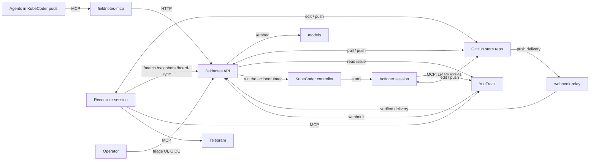
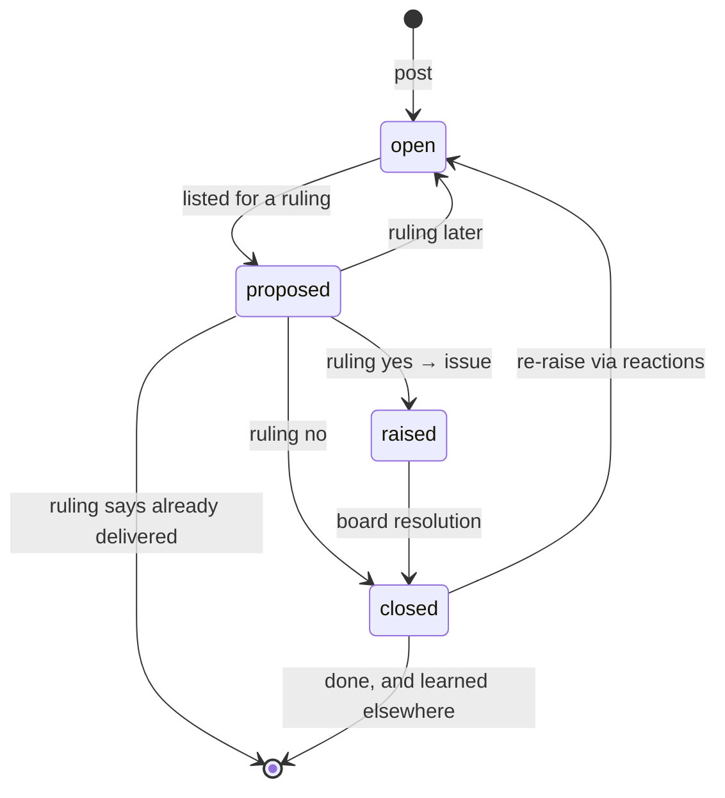

# Fieldnotes: design

What Fieldnotes is, the decisions it is built on, its numbered requirements and its technical design.
This is the design the first version is built from, scoped as a proof of concept: enough to find out
whether the idea proves its value. The requirement numbers (`FR-n`, `NFR-n`) are what tests and
commits cite. A decision this doc leaves open is the operator's to rule, not something to settle in
code.

## Purpose

Fieldnotes is the operator's complaint box: a curated, cross-project store for the friction agents
run into while they work. What got in an agent's way and is not theirs to fix now, which today
ends up in a close-out report with thirty other findings or in a memory file nobody else reads,
goes here instead. It still reaches the operator, through a second, lower-priority channel that is
curated before they see it, and the close-out report stays on topic. An agent posts an observation;
the server answers with what the store already knows about it, the operator's ruling included, and
the agent reacts to that instead of re-posting. That post-time answer is how knowledge reaches the
next agent, without any search tool.

The store is temporary by design. What is reported gets fixed or documented, and then its
observation is deleted; what the operator decides not to act on stays, with the reason, as the
answer the next agent gets.

A scheduled reconciler session curates the store, researches selected observations, checks the board
and puts what is worth a ruling in the operator's triage queue. The operator rules in the triage UI;
an actioner session, which the UI starts when the operator submits, turns rulings into YouTrack
issues and recorded decisions. An observation closes when the board says the work is done or will not
be done, and leaves the store once what it says is better learned somewhere else. A decision not to
act stays, and its reason is part of the answer the next reporter gets: for those the store does the
job a memory note used to do.

The tool exists to take work off the operator that the operator does not want to do, so that
observations with potential value are not lost when a project's close-out pile is cleared in one
sweep.

Working names: the store is Fieldnotes, an item is an observation.

## Decisions

The value sits in the reconciler and in the post-time duplicate response; capture is plumbing.
Everything below follows from that.

| Topic | Decision | Rationale |
| --- | --- | --- |
| Scope | Fieldnotes takes friction: what cost an agent time or got in its way and is not theirs to fix now. The reporting agent sorts what it notices: small or in scope → do it; urgent, a product bug, or a change to the product it is working on (a refactoring, a design suggestion) → the close-out report, because the operator has a say in the product and decides there; everything else that got in the way, however minor → Fieldnotes. | Ruled after gate 2: an agent can think of a hundred hints in any decent chunk of work, and a hint with no friction behind it never finds the agent who needs it, since the store is only reached by reporting. Friction is self-limiting and self-routing. It also takes the long tail out of close-out reports, which regularly ran past thirty findings. "At least to start out with." |
| Category | Enum `hint` / `idea` / `friction`, no `bug`. Every post is friction; the category says what comes with it: `friction` the complaint alone, `hint` the complaint and what got the reporter past it, `idea` the complaint and how they would remove it. Non-normative, the reconciler may recategorize. | The enum and both surfaces stay as built, so widening the scope later is a change of words. A `hint` tells the reconciler the workaround is already in the text. Product bugs go to the operator through the close-out report. |
| Duplicates | `post` returns the candidates that clear the *related* threshold, at most 3, open and closed, with their reaction counts and what was ruled on them, and creates nothing; the reporter reacts, or creates with `force`. When nothing clears the threshold it creates and returns no candidates. | This response is the knowledge-delivery moment, so it must not cry wolf: a list that is always three long teaches the reporter to ignore it. Closed items stay matchable for as long as they are kept, so recurrence becomes a re-raise signal and a ruling reaches whoever meets the thing next. |
| Reactions | One tool `react(id, emoji, text?, repo, session?)`; emoji uncurated, allows 👎. | Vote and comment merge cleanly; the emoji carries the claim type, text only when there is new information. |
| Agent search | None. Only `post`, `react`, `get`. What comes back from a `post` is to be trusted: the statement is the reconciler's, which has read every report across projects, and the `reason` is the operator's. | The store is not a reference. It is temporary: everything in it is on its way to being fixed or documented, and is deleted when it is. A search tool would make agents treat a complaint box as documentation. First ruled on the grounds that observations are unverified; re-ruled after gate 2, when curation and rulings turned out to carry most of what comes back. |
| Reconciler | A session scheduled by a KubeCoder timer on a skill in the store repo, not a server feature. It owns the observation files and has free rein over them; everything outside the store is a proposal. | Keeps the server dumb; all judgment lives in versioned skills. |
| Vetting | The reconciler writes only the triage items. Documentation changes are recommended in text and become issues after a `yes` ruling, like everything else. | Docs are what every later agent reads; a wrong edit propagates. Ruling history will show what can be delegated later. |
| Output | Triage items in the store, one file per observation listed (ask, evidence, recommendation, impact, every report on it → ruling), plus a Telegram message with the size of the operator's queue and the triage UI's address. No cap, no threshold. An item stays in the queue until it is ruled; the reconciler lists an observation again only when it has something new to say. | A cap drops important items when volume is high and pads when it is low. Rulings are also calibration data for the next pass. Ruled 2026-09-26 with the triage UI: records instead of documents, so that nothing is ruled in an old document or lost in one; the document's summary and its second half, every new report word for word, went with it, the operator having read the raw reports for the while they asked for. |
| Rulings | A verb, `yes`, `no` or `later`, and a note written as the operator would say it: the reason for a `no`, the revisit trigger for a `later`, and whatever else the actioner should know, a merge included. The actioner reads a ruling; it does not parse one. When it cannot read one with confidence it asks back on the item, and the operator answers in the queue. A ruling's reason is returned to the next reporter whose post matches. | "no with reason" is the decision record; "later" is where evidence-gathering time lives. Ruled at gate 2: the ruling is the operator's channel to the agents, used to say "I raised that card myself", "that shipped last week" and "this is expected, trust it" as often as `yes`, and no fixed grammar holds that. The verb and one note field were ruled with the triage UI. |
| Triage UI | One screen in the app: the queue as a stack, one item at a time beside the observation as it stands now; a verb by key and a note, saved as each ruling is made; previous, skip and progress; a finish card whose Submit starts the actioner through a KubeCoder timer. Desktop only, signed in through Keycloak and gated on the `editor` client role. Every ruling is a commit through the API's write queue. Triage only: no browsing observations, no dashboard, nothing about the actioner's runs. | Ruled 2026-09-26, when the proof of concept was judged proven: the operator's work arrives as a stack ruled in minutes, with no environment to open, no file to edit and no session to attend. The store stays the one source of truth, so a closed browser loses nothing and needs no state anywhere else. |
| Retirement | An observation is deleted once what it says is better learned elsewhere: the friction was fixed, or the hint went into documentation agents read anyway. The reconciler decides that on its own, as a rule when the card closes as done; the actioner does it for a ruling that says the work is already delivered. What was ruled and never carded stays for good. | The store is for what an agent cannot learn any other way. A recurrence after a deletion arrives as a fresh post, which is the signal that the fix did not hold. Git history is the record. |
| Closure | Closed when the board says so: a YouTrack webhook into the API, and a board scan at the start of each reconciler run. The link is one-way: the observation records its issue id in `card`, and the board carries nothing of ours. Outcome from a configured resolution field (Resolved, Absorbed → done; Won't Do → wont-do), pointer in a comment. No resolution MCP tool. | The board is trusted; the tool would duplicate it. The operator sets the resolution field after the issue reaches Done, so a later change must still be applied. |
| Card feedback | Any change to an observation's card, a comment included, puts the observation back in the reconciler's queue: board sync records the card's latest change on the file. The reconciler reads what changed and does with the observation what it judges right. | What the board learns about an observation, such as a solution or a proposed one, flows back into it, and so to the next agent whose post matches it. |
| Expiry | No TTL. Validity comes from 👎 reactions and the reconciler checking the project. | The TTL was a proxy for validity; project access replaces the proxy. |
| Storage | Git on GitHub, one file per observation; `last_updated` covers the whole file and drives the reconciler queue. Four statuses; condensing, merging and splitting are maintenance, not states. Embeddings are cached on the API's volume, content-addressed by model and hash of the embedded text. | Reversible edits and per-item history. The cache is disposable: deleting it costs a reindex and nothing else. |
| Matching | Brute-force over the whole store on the embeddings' cosine plus a weighted lexical overlap (BM25), cut by thresholds read from the eval; no reranker; reporter LLM decides. | Measured at gate 1: the cross-encoder reranker the design first had scored topic, not sameness. It told duplicates from same-topic observations worse than the embeddings' cosine did, at ten times the latency, and the operator ruled it out. The lexical weight found a fifth more duplicates than the cosine alone at the same false alarms, which no swap of embedding model did, and the operator ruled it in. |
| Models | Self-hosted Text Embeddings Inference: `BAAI/bge-base-en-v1.5`. English only. | A small CPU model matches API quality for paraphrase detection; no egress dependency. |
| Topology | One model pod (a TEI container per model behind NGINX, today one) on a pinned high-performance node, deployed from the homelab's chart repo and owned by no application. One Fieldnotes pod: the API, the MCP server, the UI's nginx, the SSE gateway and a webhook relay as five containers. No scheduler in the API. | The models are shared infrastructure. The API and the MCP server stay separate processes with an authenticated HTTP boundary between them, so the MCP server stays thin; one pod is all a proof of concept needs. |
| GitHub webhook | Deliveries reach the API through the homelab's `webhook-relay`, the only internet-facing container; the API itself is never public. | What an unauthenticated caller reaches is an HMAC check in a binary that holds no credential, not the service that holds the store's git credential. |
| Agent steering | The user-level `~/.claude/CLAUDE.md`, shared by every environment, tells agents when to post; the `dev` plugin's close-out template carries the three-bin rule. | One place reaches every project's sessions, including those that run no slice. |
| Not doing | Agent-facing search, transcript mining (dreaming), a vector database, TTL, fine-tuned reranker, reconciler-authored doc changes, a bug category. | Volume is already sufficient; a curated queue works; scale does not justify the rest. |
| Source | The field is named `repo`. A path is acceptable where no repository applies. | Repositories are the source nearly always; naming the field after the common case keeps reporters precise. |

## Functional requirements

"Must" is binding. Scheduling of sessions and the secrets a session holds are KubeCoder's and out of
scope here.

**Capture (MCP surface)**

1. FR-1 `post(area, category, text, repo, session?, force?)` must run the match pipeline unless
   `force` is set. With candidates at or above the *related* threshold it must return them, at most
   3, and create nothing. Otherwise it must create the observation and return its id.
2. FR-2 A candidate must carry: id, canonical statement, status, outcome and pointer if closed,
   the `reason` when it has one, reaction counts as an `emoji (n)` list, match score and class
   (`likely` or `related`), and the literal next step (`react` with the id, or `post` with `force`).
   The reason is what the operator ruled or the board decided, written for the agent who has just
   met the thing. It is returned, never matched: only the area and the canonical statement are
   embedded.
3. FR-3 Matching must include closed observations.
4. FR-4 `react(id, emoji, text?, repo, session?)` must append a reaction with provenance and update
   `last_seen`. Reactions on closed observations are allowed; the reconciler treats them as a
   re-raise.
5. FR-5 `get(id)` must return the full observation including reactions and comments.
6. FR-6 The MCP server exposes exactly `post`, `react`, `get`. No search tool.
7. FR-7 `area` is free text; `category` is one of `hint`, `idea`, `friction`, all three of them
   friction, told apart by what the reporter brings with the complaint (nothing, a way past it, a
   way to remove it); `repo` names the repository, a path only where no repository applies;
   `session` is optional provenance. Product bugs are not observations: they go to the operator
   through the close-out report.

**Store and lifecycle**

8. FR-8 One markdown file per observation, `observations/<ulid>.md`, with frontmatter: `id`,
   `status`, `area`, `category`, `repos`, `created`, `last_updated`, `last_reviewed`, `last_seen`,
   `canonical`, `outcome`, `reason`, `card`, `card_updated`, `pointer`. The body holds reactions and
   comments in order; the creating post is the first reaction entry, so every report has the same
   provenance shape.
9. FR-9 Every server write is a commit on `main`, pushed. Skills edit files directly and push. A
   GitHub push delivery makes the server pull and reindex.
10. FR-10 Statuses: `open`, `proposed`, `raised`, `closed`. `outcome` is `done` or `wont-do`.
    `last_updated` changes on any write to the file, by anyone.
11. FR-11 Condensing, merging and splitting are reconciler maintenance, not states. A closed
    observation may be rewritten into a compact record and stays matchable; new information may
    still be merged into it. A merged-away observation's file is removed and its content folded into
    the survivor; git history is the record. An observation whose content is better learned
    elsewhere (the friction was fixed, the hint is now in documentation agents read anyway) is
    deleted; a recurrence arrives as a new post.

**Reconciler**

12. FR-12 Runs as a session started by a KubeCoder timer in an environment of the store's project,
    with the store checkout, the REST API, and the YouTrack, Telegram and KubeCoder fleet MCP tools
    available. The session first runs the `install` skill, which pulls `main` and then loads the
    requested skill.
13. FR-13 Work queue: observations with `last_updated > last_reviewed`. The run starts with a board
    scan: for every observation with a `card` it asks the API to sync that observation against the
    board, covering missed webhooks.
14. FR-14 Owns the observation files and may do with them whatever it judges right: merge, split,
    condense, recategorize, rewrite canonical statements, edit, merge or delete reactions and
    comments, add its own, close as duplicate, delete an observation that has done its work (FR-11),
    without asking. Must not change project repositories, documentation or the board; its only
    outputs are the store and the triage items.
15. FR-15 Must write one triage item per observation it lists, `triage/<observation-id>.json`.
    Which observations it lists is at its discretion: only what it judges of interest, never
    everything. Per item: the observation id, a headline, ask, evidence (count, distinct repos, first
    and last seen), recommendation, impact, the observation as it stood, and every report on it in
    the agent's own words; the three state fields are left empty (FR-18). Listing an `open`
    observation makes it `proposed`. Recommended documentation changes are described in text, not
    drafted. An open item stays in the operator's queue until it is ruled, so an observation is
    listed again only when the run has something new to say about it: its open item is then
    rewritten in place, the reports the operator has not been shown marked new, and a draft ruling
    on it dropped. An item that is submitted, or carries the actioner's question, is not rewritten.
    A run with nothing to rule on writes no item. The document's second half, every new report word
    for word, was retired with the triage UI (2026-09-26).
16. FR-16 Must read prior rulings before composing: the stamped items, the open ones, and the
    triage documents from before the items. Must send a Telegram message with the number of items in
    the operator's queue and the triage UI's address when it wrote or rewrote an item, and none when
    it did not.
17. FR-17 To understand an item it may clone the relevant repository or start a KubeCoder
    environment. Research only; no changes there.

**Ruling and actioner**

18. FR-18 Each triage item carries three state fields, each written by one party: the operator's
    `ruling`, a verb (`yes`, `no` or `later`) and a note, with the time it was made and the time it
    was submitted; the actioner's `question`; and the actioner's `actioned` stamp. The note is
    whatever else the actioner should know or do: the reason for a `no`, the trigger for a `later`, a
    card the operator already raised, a fix that already shipped, where an issue belongs, what the
    observation should say, a merge. The ruling is the operator's channel to the actioner and is
    read, not parsed: the verb is the lead, the prose is the instruction. A ruling that is not
    submitted is a draft, and nobody but the operator acts on it.
19. FR-19 The `actioner` skill, run unattended by a KubeCoder timer the API runs (FR-27) when the
    operator submits, carries out each submitted item that has no `actioned` stamp, through the
    YouTrack MCP tools and on the observation files, with the judgment the reconciler has over the
    files (FR-14). Its defaults: `yes` → an issue whose description names the observation id for the
    reader, the issue id written to the observation's `card`, status `raised`; a card the operator
    says they raised themselves is linked and no issue is created; work the operator says is already
    delivered gets no issue and the observation is deleted, on the operator's word or after a
    read-only check (as FR-17), as the actioner judges. `no` → `closed`, outcome `wont-do`, and the
    note written into `reason` for the agent who meets the observation next (FR-2); a `no` that asks
    for a card on something else gets both. `later` → the trigger noted on the observation, status
    back to `open`. A merge the note asks for → merged. An issue goes to the intake queue of the
    project that owns the fix, and to `FN` when no project owns it or it spans repositories. When a
    ruling can be read two ways, or what the actioner finds does not match it, it guesses at nothing
    that leaves the store: it writes a question on the item, which clears `submitted` and puts the
    item back in the operator's queue, first; the answer comes back as the ruling submitted again,
    beside the question. Each item dealt with is stamped `actioned` with the time and what was done
    and moves to `triage/done/`, so reruns are no-ops. The run looks once more for items submitted
    while it ran, and ends with one Telegram message: what was done, and what was asked.

**Board sync**

20. FR-20 The REST API verifies and handles two webhooks: GitHub push (HMAC-SHA256 signature against
    a configured secret, re-verified by the API although the relay verified it first) and YouTrack
    issue and comment events (shared token).
21. FR-21 A YouTrack event names an issue. The observation it concerns is the one whose `card` is
    that issue; an event for any other issue is ignored. The API reads the issue's current state
    from YouTrack and applies it, so the result never depends on which event arrived or in what
    order, and the board needs no field of ours. The outcome
    follows a configured resolution field and value map: `Resolved`, `Absorbed` → `done`;
    `Won't Do` → `wont-do`. A later change to the field updates the outcome. A comment
    `Resolved: <pointer>` supplies the pointer. The sync also records the time of the card's latest
    change, comments included, in `card_updated`, and writes nothing when nothing changed. The
    reconciler's board scan runs the same routine.
22. FR-22 Any change to the card, a comment included, must put its observation in the reconciler's
    queue: a new `card_updated` changes `last_updated` (FR-10, FR-13). For a queued observation with
    a card, the reconciler must read what changed on the card since `last_reviewed`, and folds into
    the observation what bears on it, such as a solution, a proposed one or a workaround, in
    whatever form it judges right (FR-14).

**Triage**

23. FR-23 The operator's queue: every item in `triage/` (not `triage/done/`, not `triage/archive/`)
    whose ruling is absent or not submitted. An item with a `question` and no `submitted` is a
    returned item: it is in the queue with the ruling it had, so the operator sees what they ruled
    before. Returned items come first, then the rest, each group by the time the item was written
    (`written`), oldest first. Beside the items the queue carries each item's observation as it
    stands now, in the fields of the item's snapshot, or null for an observation the store no
    longer has (merged away or deleted), so the UI shows what changed since the item was written.
    The API reads the items at startup and after every pull, and each of its writes updates what it
    read. An item that does not parse or does not pass the store's rules is left out of the queue
    and logged; it never fails the whole queue. Skips and unsaved notes are the browser's, and the
    API knows nothing of either.
24. FR-24 The operator's writes, a ruling, its take-back and a submit (FR-25, FR-26), must each be
    one commit on `main` through the API's write queue, pushed before the reply (FR-9): a success
    means the write is on the remote. A write that fails is the reply (`store-unreachable`), and
    nothing else reports it. The UI does not wait on a write: it applies a ruling and moves on at
    once, and shows a failed reply. An item the API writes passes the store's rules, and its diff
    is the `ruling` alone.
25. FR-25 A ruling sets an item's `ruling` to a verb (`yes`, `no` or `later`), a note stripped of
    surrounding whitespace, the time it was made (`at`) and no `submitted`, over any earlier draft.
    A `no` or a `later` without a note is refused: the note is what the actioner and the next
    reporter get (FR-18, FR-19). A returned item keeps its `question`, and a ruling made after the
    question is its answer (FR-19). A take-back clears a draft (`ruling` null); on an item without a
    ruling it writes nothing. Both carry the item's `written` as the operator's page saw it, and
    both are refused, writing nothing: as `conflict` when the store's `written` no longer matches
    it, because the reconciler rewrote the item after the page loaded and dropped any draft on it
    (FR-15), when the item is submitted and so the actioner's, or when it does not parse or does
    not pass the store's rules and so is not in the queue (FR-23); as `not-found` when `triage/`
    holds no such item (it was stamped, or withdrawn). Each refusal is decided on the item as the
    store holds it at the tip the write lands on. A ruling refused for a rewrite is dropped, and
    nothing but the refusal signals it: the operator meets the rewritten item on the next fetch of
    the queue.
26. FR-26 Submit marks every ruled, unsubmitted item in `triage/` submitted, with the time, in one
    write, and answers with the ids it submitted. A returned item counts as ruled only once its
    ruling's `at` is later than its question's; until the operator rules it again it is not
    submitted and stays in the queue. With nothing to submit, submit writes nothing, starts nothing
    and is not an error.
27. FR-27 A submit that submitted something must start the actioner (FR-19) after its write and off
    the request, so the reply does not wait on it: the API runs the actioner's timer through the
    KubeCoder controller, with a client token of its own. When the controller refuses because a run
    is in flight, the API tries again a minute later, for as long as submitted items without an
    `actioned` stamp are waiting, and stops once none is. At most one start waits at a time, and a
    submit made meanwhile is covered by it. Any other failure is logged and counted, not retried. A
    restarted API resumes no waiting start: the items wait for the next submit or the timer's
    **Run now** in KubeCoder. The API polls nothing for display and the UI hears nothing of the
    actioner: a failed run is KubeCoder's own Telegram message, and **Run now** is its retry.
    Without the controller's address, the token and the timer's id the API still starts and submit
    still writes; the start is skipped and logged.

**Non-functional**

28. NFR-1 `post` p95 under 2 s.
29. NFR-2 200 actions per week; 10,000 observations without redesign.
30. NFR-3 English only. No runtime dependency outside the cluster, GitHub and YouTrack excepted.
31. NFR-4 The agents' and the skills' REST endpoints and the MCP server authenticated the way the
    KubeCoder MCP server is: a static bearer token on each boundary. The operator's triage
    endpoints (FR-23 to FR-27) take the template's OIDC session with the `editor` client role
    instead: a request without a session, or with an agent's bearer token, is refused as
    unauthenticated, and a signed-in user without the role as forbidden, reads and writes alike.
    Webhook secrets verified on every request.

## Technical design

One pod with logic, one model pod, one git repo on GitHub, three skills. The REST API is the only
component that decides anything; everything else is off the shelf or thin.

```mermaid
flowchart LR
  A[Agents in KubeCoder pods] -->|MCP| M[fieldnotes-mcp]
  M -->|HTTP| R[fieldnotes API]
  R -->|/embed| E[models]
  R <-->|pull / push| G[GitHub store repo]
  G -->|push delivery| W[webhook-relay]
  W -->|verified delivery| R
  Y[YouTrack] -->|webhook| R
  R -->|read issue| Y
  S[Reconciler session] <-->|edit / push| G
  S -->|/match /neighbors /board-sync| R
  S -->|MCP| Y
  S -->|MCP| T[Telegram]
  X[Actioner session] -->|MCP: create issues| Y
  X <-->|edit / push| G
  O[Operator] -->|triage UI, OIDC| R
  R -->|run the actioner timer| K[KubeCoder controller]
  K -->|starts| X
```

Agents talk only to the MCP server; the skills talk to the store, the API and the board. GitHub and
the board talk back to the API alone. The operator rules in the UI, and a submit makes the API run
the actioner's timer at the KubeCoder controller.

### This repo

A ModernAppTemplate app: the root, `backend/` and `frontend/` are each generated from a Copier
template, and [CLAUDE.md](../CLAUDE.md) says which files the template owns. The backend is one uv
workspace:

| Path | Content |
| --- | --- |
| `backend/app/fieldnotes/` | The domain: the store and its write queue (a worker thread), the index, the match pipeline, board sync, the webhooks' verification, the triage index, the operator's rulings, the actioner start, the metrics, and the `Runtime` that builds them from the settings. |
| `backend/app/api/fieldnotes.py` | The agents' REST surface, a blueprint under the template's `/api`. Its endpoints are public to the template's OIDC hook and check a client's bearer themselves. |
| `backend/app/api/triage.py` | The triage UI's REST surface, a blueprint at `/api/triage`. Its endpoints are gated on the operator's OIDC session with the `editor` client role and typed in the template's OpenAPI document. |
| `backend/app/services/fieldnotes_service.py` | The runtime inside the app: started with the background services, stopped on shutdown, reported to `/health/readyz` and `/metrics`. |
| `backend/packages/fieldnotes-contracts/` | The pydantic wire models of the REST surface, shared by the API and the MCP server as a live workspace source. The models are the contract; the API validates with them directly. |
| `backend/mcp-server/` | `fieldnotes-mcp`: FastMCP on the official `mcp` SDK, streamable HTTP at `/mcp`, stateless. One module holds the three tools; one client module is the only code that speaks HTTP to the API. |
| `backend/eval/` | The replay and eval harness. Code and invented fixtures only: the mined dataset is private and is passed in by path. |
| `frontend/` | The operator's UI: React, TanStack Router and Query, a client generated from the backend's OpenAPI document, OIDC sign-in through the backend. The one screen is the triage stack, `src/components/triage/`, with its logic in `src/hooks/use-triage.ts`: a port of the operator's mockup (`FieldnotesAppSpecs/mockups/triage-ui/`), its styles in `src/components/triage/triage.css` and its colours in `src/styles/app-theme.css`. |
| `backend/Dockerfile`, `frontend/Dockerfile`, `Jenkinsfile` | Two images: the backend carries both entry points, the frontend serves the SPA. Built by kaniko on push. |

Conventions: settings read once at startup from `FIELDNOTES_*` environment variables into a frozen
dataclass, beside the template's own; errors as RFC 9457 `application/problem+json` with a closed set
of `type` slugs and operator-facing prose; unauthenticated health checks (the template's
`/health/healthz` and `/health/readyz` on the backend, `/healthz` and `/readyz` on the MCP server);
ruff, mypy strict, vulture and pytest; tests run everything this repo owns for real and fake only
what it does not (the model pod, GitHub, YouTrack, the KubeCoder controller); a test pins each
surface by equality.

### Services

| Service | What it is | Placement |
| --- | --- | --- |
| `models` | One pod: NGINX in front of a TEI CPU container per model, routing by path; today one, the embedder at `/embed`. A volume caches the downloaded models, so the pod starts without egress after the first run. | A chart of its own in the homelab's chart repo, pinned by node affinity and toleration to the high-performance node. |
| `fieldnotes` | One pod: the backend `app` (the API, on 3401), the `ui` (on 3400, which proxies `/api`), the template's `sse-gateway`, `mcp` and, where the store takes webhooks, `webhook-relay`. A volume holds the store checkout and the embedding cache. Services select the pod: the UI for the operator, the MCP server for agents, the relay as the one public hostname. `Recreate` strategy, since the checkout has a single writer. | The chart in `pvginkel/FieldnotesDeploy`, one values file per stage; secrets from OpenBao through External Secrets, or generated by it. |

API endpoints, under `/api`: `POST /observations`, `POST /observations/{id}/reactions`,
`GET /observations/{id}`, `POST /observations/{id}/board-sync`, `POST /match`,
`GET /observations/{id}/neighbors`, `POST /hooks/github`, `POST /hooks/youtrack`, and the operator's
triage endpoints, `GET /triage/queue`, `PUT` and `DELETE /triage/items/{id}/ruling` and
`POST /triage/submit` (FR-23 to FR-27), typed in the template's OpenAPI document, from which the UI
generates its client. Beside them the template's `GET /health/healthz`, `GET /health/readyz` and
`GET /metrics`.

The agents' and the skills' callers authenticate with a bearer token that resolves to a named client
(`mcp`, `skills`); the name is logged with each write. The triage endpoints take the operator's OIDC
session instead (NFR-4), and their writes are logged and committed as the operator's. The MCP server
takes its own inbound bearer token from agents and holds the `mcp` client token outbound.

### The store repo

| Path | Content |
| --- | --- |
| `observations/<ulid>.md` | One observation per file, frontmatter as in FR-8, body: `### reactions` then `### comments`, append-only for the server |
| `triage/<observation-id>.json` | An open triage item: the reconciler's texts, the observation as it stood and every report on it, then the operator's ruling and the actioner's question (FR-15, FR-18) |
| `triage/done/<date>-<observation-id>.json` | A stamped item; with `triage/archive/`, the triage documents from before the items, the calibration history |
| `skills/install/` | `SKILL.md`: pull `main` into the session's checkout, then load the skill named in the prompt |
| `skills/reconciler/` | `SKILL.md` plus Python helpers |
| `skills/actioner/` | `SKILL.md` plus Python helpers |
| `.kubecoder/` | Makes the store a KubeCoder project, so its timers can run the reconciler and the actioner in an environment of it |

Embedded text is `area + ": " + canonical`. Comments and reactions never change it, so they never
trigger a re-embed; a reconciler rewrite of `canonical` does.

### Writing to the store

All writes go through one queue, so the checkout has one writer. A write fetches and rebases onto
`origin/main`, changes the file, commits and pushes. A rejected push means a skill pushed in between:
the write rebases and pushes again, which is how two writers share a remote, not a retry on
suspicion. Pull-and-reindex jobs from the GitHub webhook run in the same queue.

### Match pipeline

`POST /match {text, area?, k}`:

1. Embed the query via `/embed`, the pipeline's one model call.
2. Score it against every observation, over all statuses: the cosine of the two vectors over the
   in-memory matrix, plus a lexical overlap times a configured weight. The overlap is the
   observation's BM25 score for the query (identifiers, paths, error strings) over the score the
   query's own terms would earn, so it lies in about 0–1 whatever the query's length. The weight
   defaults to 0.25; at zero the score is the cosine.
3. Classify each observation: `likely` at or above the high threshold, `related` at or above the low
   one, dropped below it. Then drop any that trails the best one by more than a configured gap, so
   one strong match does not carry weak ones along.
4. Return the top `k` that remain, with cosine, score, class and reaction counts, and the store
   commit the index had taken in, so a skill that pushed can tell whether its push was scored.

**Why a threshold, and on what.** A list that is always three long teaches the reporter to ignore
it, so the cut is a threshold, and the expected answer to a novel post is zero candidates. The
design first put that threshold on a cross-encoder reranker's score, as the absolute estimate of
sameness that a cosine is not. Gate 1 measured the opposite on the mined dataset:
`BAAI/bge-reranker-base` scored two observations on one subject close to 1 whatever point each made,
told duplicates from same-topic observations worse than the plain cosine did (AUC 0.85 against
0.91), and found half as many duplicates at the same false-alarm rate, at ten times the latency. The
operator ruled it out. The same gate compared scorers at matched false-alarm rates: six embedding
models differed by less than 59 duplicates can tell apart, while a lexical weight anywhere from 0.2
to 0.75 found more duplicates than the cosine alone at every rate, and in a replay at 0.25 it found
43 of 59 against 36 and lost none. The operator ruled 0.25. A cosine's absolute value belongs to its
embedding model, so the thresholds and the gap are config read from the eval's score distributions
for that model and weight, and are read again when either changes. No LLM is involved.

What no scorer measured so far does well is tell a duplicate from a different point on the same
subject: most false alarms are such pairs. Two things stand behind the matcher. The reporter reads
the candidates and decides; and the reconciler merges the duplicates that slipped through.

Budget, from the model smoke on the high-performance node (8 vCPUs, shared with the KubeCoder
environments): embedding one text 100–250 ms. Scoring the store is a matrix product and a walk over
the query's postings, milliseconds at NFR-2's scale. What is left of a post that creates is the git
commit and the push.

### Index maintenance

On start and after every pull that changed `observations/`: for each observation hash the embedded
text; look up `<model>/<sha256>` in the cache directory on the volume; embed what is missing and
write it; rebuild the matrix and the BM25 index. One routine covers cold start, skill edits and model
changes. Deleting the cache directory forces a full reindex and loses nothing.

### Observation lifecycle

```mermaid
stateDiagram-v2
  [*] --> open: post
  open --> proposed: listed for a ruling
  proposed --> raised: ruling yes → issue
  proposed --> closed: ruling no
  proposed --> open: ruling later
  proposed --> [*]: ruling says already delivered
  raised --> closed: board resolution
  closed --> open: re-raise via reactions
  closed --> [*]: done, and learned elsewhere
```

Condensing, merging and splitting change file contents, not status. `outcome`, `reason`, `card` and
`pointer` are fields on the file; a re-raise reopens with history attached. The two ways out are
deletions (FR-11): a `closed` / `wont-do` observation never takes one, because its `reason` is what
it is kept for.

### Webhooks

**GitHub.** The store repo's webhook is registered at the relay's public hostname. The relay verifies
the signature and forwards the raw delivery, signature headers included, to `/api/hooks/github`, which
verifies it again over the exact bytes received. The relay allows each receiver four seconds, so the
handler never pulls inline: a `push` to the store's `main` queues a pull-and-reindex and answers at
once; `ping`, every other event and every other repository are answered `200` and ignored. The
server's own pushes come back as deliveries and cost one no-op fetch.

**YouTrack.** The board posts issue and comment events to `/api/hooks/youtrack` with a shared token,
in-cluster, with no relay. The handler takes the issue id from the event and looks up the
observation whose `card` is that issue; most board events concern issues Fieldnotes never raised,
and those are answered `200` and ignored without a call to YouTrack. For a match it runs the
board-sync routine: read the issue from YouTrack's REST API with a read-only token, map the
resolution field per FR-21, take the pointer from a `Resolved: <pointer>` comment, and write status,
outcome, pointer and `card_updated`; a sync that changes nothing writes nothing, so a rescan dirties
no observation. `POST /observations/{id}/board-sync` runs the same routine from the observation's
`card`, and is what the reconciler's board scan calls, so the field map lives in one place: the
API's config.

### Skills

**Install.** The scheduled session's prompt is "pull, then load skill X". The install skill fetches
and fast-forwards `main` in the session's checkout, then loads the named skill, so every run uses the
current skill and data even though the checkout is not the API's.

**Reconciler.** The run: board scan, read prior rulings, walk the queue, read what changed on the
card of each queued observation that has one (FR-22), use `/neighbors` for missed duplicates,
research selected items by cloning the repository or in a KubeCoder environment, edit observations,
set `last_reviewed`, write the triage items, commit, push, send the Telegram message. Helpers are
Python where a script is more reliable than prose: the work queue from timestamps, the triage items
written from an item list, an open item rewritten or withdrawn. A `--dry-run` mode pushes nothing and sends nothing. The skill takes the
store root as a parameter, defaulting to its own repo, so it can be run against a generated test
store.

**Actioner.** Run by its timer when the operator submits, with nobody in the session. A helper
lists the submitted items that carry no stamp; the session reads each one, verb and note together,
and carries it out (FR-19): issues through the YouTrack MCP tools, fields on the observation through
the reconciler's helpers, a deletion where the work is already delivered. It writes the `reason` of
a `no` for the agent who will be shown it, not as a copy of what the operator wrote to the actioner.
Each item is stamped and moved to `triage/done/` as it is finished, or handed back with a question,
and the run commits and pushes as it goes. A stamped item is skipped.

### Security and config

Bearer tokens on the agents' API and the MCP server, and the template's OIDC session with the
`editor` client role on the operator's triage endpoints (NFR-4); the GitHub webhook secret and the
YouTrack webhook token verified before any processing. The API holds a GitHub credential scoped to
the store repo, a read-only YouTrack token and the token of its own KubeCoder client, which runs the
actioner's timer (FR-27); skills use the session's own credentials, provided by KubeCoder.
Thresholds, model names, the resolution field and value map, the actioner's timer, and endpoints are
configuration, not code. Every secret is an OpenBao leaf materialised by External Secrets and
referenced by `secretKeyRef`; none is ever in a config file, an image or this repo.

## Validation

The mined dataset (observations extracted from the close-out reports and agent memory files of
earlier work, with labeled duplicate clusters and pairs) is private and lives in the spec repo. It is
test material and stays that: the production store starts empty (ruled 2026-09-21: "if these really
are issues, they'll surface soon enough").

| Check | How | Pass |
| --- | --- | --- |
| Model smoke | Embed two paraphrases and one unrelated text, time one embedding at observation length | Paraphrase cosine above unrelated; timing recorded |
| Replay (gate 1) | The harness generates an empty store as a local git repo, runs the API against it with the real models, and posts the dataset in date order. A post whose labeled duplicate is already in the store should come back with it; a novel post should come back empty | Recall@3 on duplicates and the false-alarm rate on novel posts reported, as answered and with no threshold; thresholds and gap chosen from the score distributions and committed to config; `post` p95 under 2 s |
| Index rebuild | Delete the cache directory, restart the API | Index equal to before; one vector per observation |
| GitHub webhook | Post a signed push delivery after editing a canonical statement in the remote; then a bad signature | Only that observation re-embedded and `/neighbors` reflects it; bad signature rejected, nothing pulled |
| MCP end-to-end | Scripted MCP client: `post` a known duplicate, `react` on the returned id, `get` it, `post` with `force` | Duplicate returned with reaction counts, no new file; reaction appended; forced post creates a file |
| Board sync | Raise an issue by hand and set an observation's `card` to it, move the issue to Done with a `Resolved:` comment, then change the resolution field to Won't Do | Observation `closed` / `done` with pointer; outcome changes to `wont-do` on the second event; with webhooks disabled, closed after the next board scan |
| Card feedback | Comment a workaround on a raised observation's card, sync it twice, then run the reconciler with `--dry-run` | `card_updated` moves on the first sync and the second writes nothing; the observation is in the queue; the reconciler's edit carries the workaround |
| Reconciler (gate 2) | Run the skill with `--dry-run` on the store the replay produced | Triage items the operator can rule on without asking questions back; every listed item has evidence and a recommendation |
| Actioner idempotency | Submit rulings on items, run the actioner twice | Second run creates nothing and reports zero actions |

The suites behind `kc project test` are hermetic and cover none of the rows that need real models, a
real board or a cluster; those are scripts in `eval/` or documented manual steps.

## Deferred

Each has a trigger that would justify it.

- The embedding cache as an orphan branch in the store repo, so a fresh volume starts warm — trigger:
  a cold reindex takes long enough to matter.
- OIDC on the MCP server — trigger: a caller outside the homelab.
- The 10,000-observation latency run — trigger: the store passes a thousand.
- Expiry as a batched recommendation — trigger: the open set passes a few hundred items and
  reconciler cost or triage noise rises.
- Reconciler-authored documentation changes — trigger: ruling history shows near-100 % `yes` on
  documentation items.
- A `bug` category — trigger: environment or harness bugs keep arriving as `friction` with no better
  home.
- A model trained for sameness on the labeled pairs, a fine-tuned cross-encoder or embedder — not
  for phase 1 (operator, gate 1). Trigger: the matcher's misses or false alarms cost more than the
  reporter and the reconciler absorb.
- Transcript mining ("dreaming") — not planned; the reporter's judgment at capture time is the
  filter.
- Agent-facing search — not planned; the store is temporary and project documentation is the
  knowledge base agents read.
- Multilingual models — trigger: Dutch observations appear.
- A vector database — trigger: none foreseeable at this scale.
